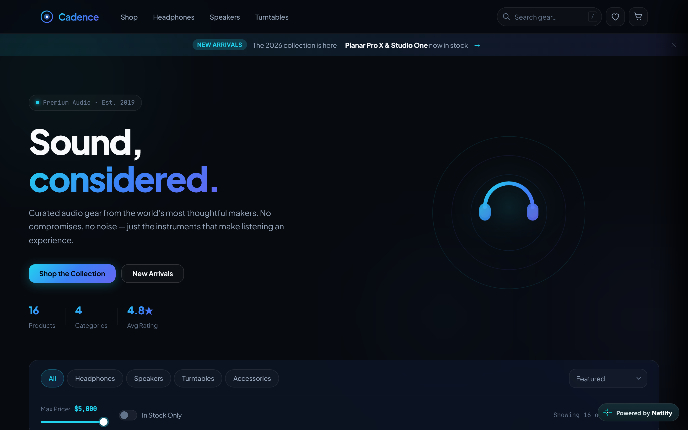
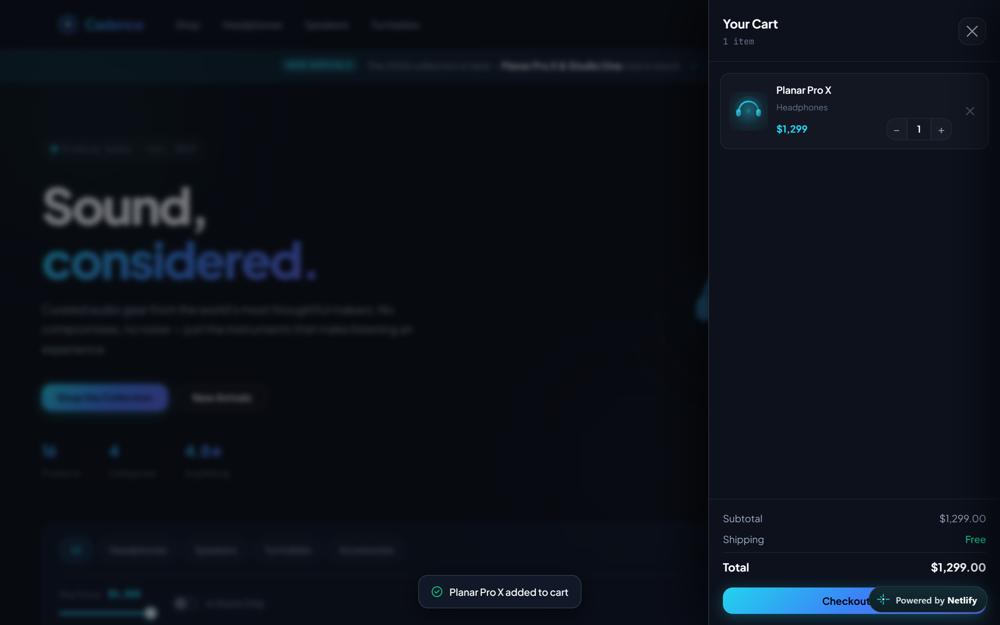
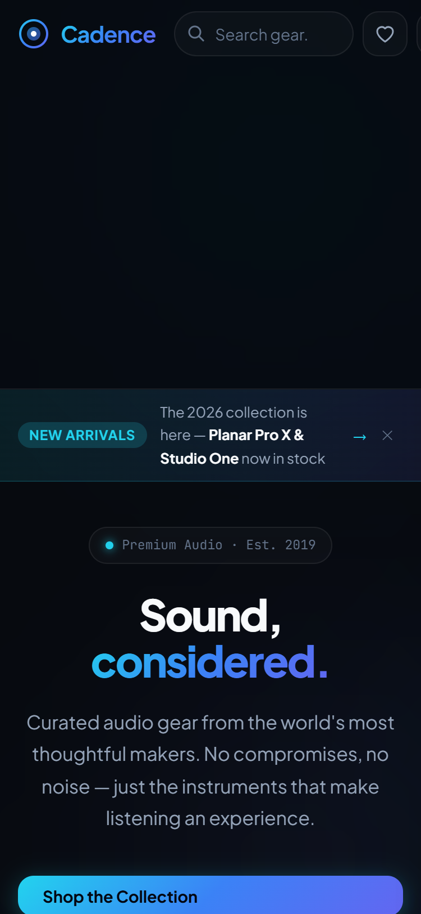

# Cadence — Premium Audio Gear Store

> **Auspify Technologies Internship — Task 5 (E-Commerce Product Interface)**

A modern e-commerce frontend for **Cadence**, a curated audio gear store (headphones, speakers, turntables, accessories). Built entirely frontend-side with a 16-product static catalog, composable filtering, a persistent cart, and a wishlist — completing the 4-project portfolio's shared design system.

   

## Live Demo
[cadence-ecommerce.netlify.app](https://cadence-ecommerce.netlify.app)

## Features

- **16-product catalog** across 4 categories (Headphones, Speakers, Turntables, Accessories), each with unique per-category SVG art
- **Composable filtering** — category, price range, in-stock toggle, and live search all work together without resetting each other
- **Sort control** — price (low/high), rating, newest
- **Shopping cart drawer** — quantity steppers, item removal, running subtotal, "fly to cart" animation on add
- **Product detail modal** — full description, specs, independent quantity selector
- **Wishlist** — heart-toggle on any product, its own slide-in drawer, live badge count
- **Full `localStorage` persistence** for both cart and wishlist
- **Animated checkout flow** with an order-confirmation state (no real backend needed)
- **Designed empty states** for empty cart, wishlist, and no search/filter results
- **Toast notifications** for all actions — no `alert()`/`confirm()` anywhere
- Respects `prefers-reduced-motion`, and every interactive element has proper ARIA labeling
- Fully responsive 4 → 2 → 1 column product grid

## Screenshots

### Desktop


### Key Feature


### Mobile


## Design System

Shares the same visual language as [PulseTrack](#), [Flowboard](#), and [Skyline](#) to read as one unified portfolio:

| Token | Value |
|---|---|
| Background | `#070A0F` |
| Accent Gradient | `#22D3EE` → `#3B82F6` → `#6366F1` |
| Font | Plus Jakarta Sans |

## Project Structure

```
Cadence/
├── index.html      # Semantic HTML5 markup
├── style.css       # Design system, product grid, drawers, modal, animations
├── app.js          # State management: filters, sort, cart, wishlist
└── products.js     # Static catalog of 16 products
```

## Running Locally

No build step or dependencies required.

```bash
python -m http.server 3000
# or
npx serve .
```

Then open `http://localhost:3000` in your browser.

## Built With

- HTML5
- CSS3 (CSS Grid, custom properties, `backdrop-filter`)
- Vanilla JavaScript (centralized state object, event delegation, `localStorage`)

---

**Part of a 4-project internship submission for Auspify Technologies.**
See also: [PulseTrack](https://github.com/fahadmusa725/pulsetrack-landing-page) · [Flowboard](https://github.com/fahadmusa725/flowboard-task-manager) · [Skyline](https://github.com/fahadmusa725/skyline-weather-dashboard)